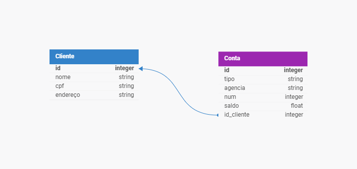

# Integrando-Python-com-SQLite-e-MongoDB

- Curso: Python Development
- Módulo: Integrando-Python-com-SQLite-e-MongoDB
- Instrutor: Juliana Mascarenhas
- Instituição: [DIO.me](https://www.dio.me/)
- Editor de Código: 

Neste desafio utilizei a ideia do sistema bancário criado nos módulos anteriores, utilizando o paradigma de Programação Orientada a Objetos e também integração com SQLite e MongoDB.

## Desafio

__1ª Parte:__
Na primerira parte, o desafio consiste em implementar uma aplicação de integração com SQLite utilizando a biblioteca SQLAlchemy e como base, um esquema relacional disponibilizado. Irei utilizar o esquema dentro do contexto de cliente e conta para criar as classes que irão representar as tabelas do banco de dados relacional dentro da aplicação. A __imagem 1__ abaixo nos mostrar o design do Banco de Dados Relacional:

 Imagem 1

__2ª Parte:__
Na segunda parte, o desafio foi implementar um banco NoSQL, utilizando o MongoDB Atlas para fornecer uma visão agregada do modelo relacional. Neste modelo de Banco de dados, as informações de cliente e contas existentes estão contidas dentro de documentos.

## Criando Repositório

Primeiramente criei o repositório no __GitHub__ com nome __"Integrando-Python-com-SQLite-e-MongoDB"__ e clonei o repositório para meu PC utilizando o __GitHub Desktop__.

## Criando Ambiente Virtual

Após projeto iniciado no VS Code criei um ambiente virtual para o python.
Para isso utilizei os comando abaixo:

1º Criando ambiente virtual
'''
virtualenv venv
'''

2º Ativando ambiente virtual
'''
venv/Scripts/activate
'''

## Criando Arquivos do Projeto

Com __VS Code__ aberto, criei a pasta __"SRC"__ para conter os arquivos do projeto. Após a pasta criada, criei o arquivo __"main.py"__, onde irei criar o código principal e o arquivo __"classes_config.py"__ aonde serão criadas as classes utlizadas pelo arquivo principal.
No projeto também está a pasta __"images"__ e __"auxiliares"__ para inclusão das imagens utilizadas no projeto e também os arquivos __"gitignore"__, __"LICENSE"__ e __"README.md"__.

## Arquivo classes_config.py

Neste arquivo estão as classes que serão usadas no arquivo principal __main.py__.
Usei o paradigma de Programação Orientada a Objetos para criar as classes que serão chamadas para executar funções especificas do código.

- Comecei o código importando as classes e módulos que serão utilizadas para desenvolvimento do código.

    ```
    from pprint import pprint
    from pymongo import MongoClient
    from sqlalchemy import create_engine
    from sqlalchemy import String
    from sqlalchemy import ForeignKey
    from sqlalchemy.orm import DeclarativeBase
    from sqlalchemy.orm import Mapped
    from sqlalchemy.orm import mapped_column
    from sqlalchemy.orm import relationship
    from sqlalchemy.orm import Session
    from typing import List
    ```

- As classes criadas abaixo, estão separadas por biblioteca utilizada, sendo as 4 primeiras utilizadas na lógica para implementação do SQLAlchemy e as 2 últimas para implementação do MongoDB:

    - SQLAlchemy
        1. class Base(DeclarativeBase)
        2. class Conta(Base)
        3. class CriandoObjeto
        4. class ConexaoDancoDados

        Para criação da lógica, utilizei a documentação oficial do SQLAlchemy.
        [Documentação SQLAlchemy](https://docs.sqlalchemy.org/en/20/)

    - MongoDB
        5. class ManipulandoMongoDB
        6. class ListasMongoDB(ManipulandoMongoDB)

        Para criação da lógica, utilizei a documentação oficial do PyMongoDB.
        [Documentação PyMongoDB](https://pymongo.readthedocs.io/en/stable/tutorial.html)

## Arquivo main.py

O arquivo __"main.py"__ contém as funções para cadastro de clientes e contas, listagem de clientes e contas, deletar clientes e contas. Também temos duas funções auxiliares, chamadas de "menu" e "main".

- Começando o código, importei as classes e módulos que serão utilizadas para desenvolvimento do código.

    ```
    import textwrap
    from classes_config import Cliente
    from classes_config import Conta
    from classes_config import CriandoObjeto
    from classes_config import ConexaoDancoDados
    from classes_config import ManipulandoMongoDB
    from classes_config import ListasMongoDB
    from sqlalchemy import select
    from sqlalchemy.orm import Session
    ```

- A lista de funções abaixo estão separadas por tópicos para facilitar o entendimento

    - Função para criação do menu:

        1. def menu

    - Funções para cadastro de clientes e contas:

        2. def cadastrando_cliente(engine, db)
        3. def cadastrando_conta(engine, numero_conta, db)

    - Funções para listagem de clientes, contas e todas as contas de um cliente em especifico:

        4. def lista_clientes(engine, db)
        5. def lista_contas(engine, db)
        6. def contas_cliente(engine, db)

    - Função para deletar um cliente e contas vinculadas:

        7. def delete_cliente(engine,db)

    - Função principal com a lógica para execução do sistema bancário:
        
        8. def main(engine, numero_conta)

No final do arquivo está o código que chama as classes __"ConexaoBancoDados()"__ e __"ManipulandoMongoDB()"__, a criação de uma variável chamada __"num_conta"__ com o número de conta inicial e por útlimo está a chamada da função __"main"__ que irá executar um loop para escolha da ação por parte do usuário até que ele seja finalizando digitando o número __"0"__. O trecho de código mencinado pode ser visto abaixo:

```
conexao_banco_dados = ConexaoDancoDados()
engine = conexao_banco_dados.criando_engine_db()

criando_tabelas = ConexaoDancoDados()
criando_tabelas.metadata_create_all(engine)

client = ManipulandoMongoDB()
db = client.connection_mongo_client()

num_conta = 1001

main(engine, num_conta)
```

## Testes

Para os teste criei um arquivo chamado __"dados_testes.txt"__, que está presente na pasta __"auxiliares"__.
Neste arquivo está presente os nomes, cpf e endereços de quatro pessoas fictícias, criadas apenas para efeito de exemplo nos testes.

Quando o arquivo __"main.py"__ é executado um novo terminal é aberto e um menu de opções é apresentado ao usuário.
Primeiramente utilizei a opção "1" e cadastrei os 4 clientes presentes no arquivo __"dados_testes.txt"__ mencionados anteriormente.

Após o cadastro dos clientes, iniciei o cadastro de contas. Para o cadastro de contas é pedido o número de CPF do cliente ao qual a conta ficará vinculada. Lembro que é possível cadastrar mais de uma conta para cada CPF.

Utilizando a opção "3" temos a lista de clientes cadastrados.
Na __imagem 2__ abaixo temos a lista de clientes presentes no SQLite e na __imagem 3__ temos a mesma lista de clientes presentes no MongoDB Atlas:

 Imagem 2


 Imagem 3


Agora utilizando a opção "4" temos a lista de contas cadastradas.

Na __imagem 4__ temos o retorno da lista de contas presentes no SQLite:

 Imagem 4


Na __imagem 5__ temos o retorno da lista de contas presentes no MongoDB. Reparem que o "id_cliente" é o mesmo "id" presente no cadastro do cliente:

 Imagem 5


Quase terminando os testes, agora utilizando a opção "5", temos a lista de contas a partir de um cliente específico. Para o teste desta função, também digitei o CPF número "08912455632", referente ao primeiro cliente da lista. Na __imagem 6__ temos o retorno da lista de contas vinculadas ao CPF mencionado, sendo apresentado os retornos tanto do SQLite, quanto do MongoDB Atlas:

 Imagem 6

Para terminar o teste, utilizei a opção "6". Esta opção deve ser selecionada quando é desejado excluir um cliente e suas respectivas contas do sitema do banco. Conforme __imagem 7__ e __imagem 8__ podemos ver que o cliente "Pedro Batista Saraiva" e suas respectivas contas não estão mais presentes nos Bancos de Dados SQLite e MongoDB Atlas:

 Imagem 7

 Imagem 8

Na __imagem 9__ temos o print do MongoDB Atlas, mostrando o Database, Collections e Documents criados:

 Imagem 9

## Conclusão

Este foi o meu quarto projeto de __Liguagem Python__ dentro do curso __Python Development__ e desta vez optei por fazer algo a mais que o desafio pedia. Consegui concluir as duas etapas do desafio e em cada opção selecionada, o código realizava a inclusão a/ou consulta tanto no SQLite e também no MongoDB Atlas. Este conhecimento inicial em Banco de Dados foi de grande aprendizado para mim. Agora consigo entender um pouco mais como os sistemas funcionam.
A linguagem de programação Python demonstra mais uma vez o seu poder a sua praticidade para trazer soluções na resolução de problemas.
Grande abraço a todos!!!

## Linguagens de Marcação e Programação

- 

- 

## Ferramentas e Serviços

- 

- 

- 

## Banco de Dados

- 

- 